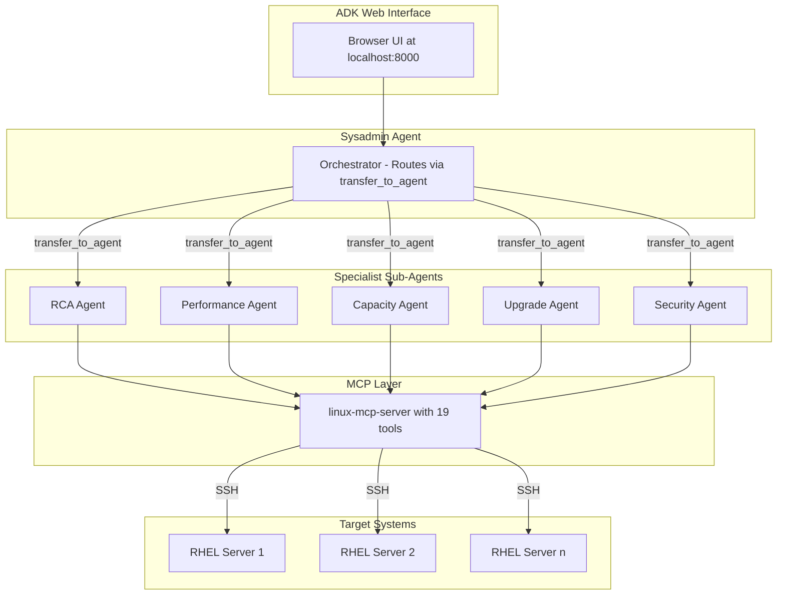
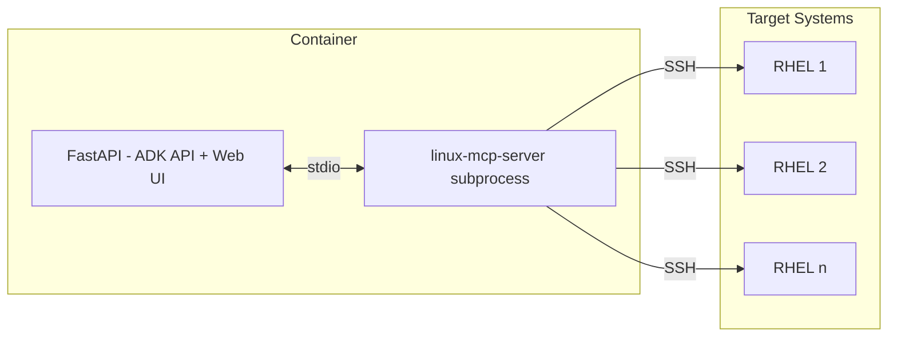

# Sysadmin Agents

Enterprise-grade AI agents for Linux/RHEL system administration, powered by [Google ADK](https://google.github.io/adk-docs/) and [linux-mcp-server](https://github.com/rhel-lightspeed/linux-mcp-server).

## What Is This?

**Sysadmin Agents** is a collection of AI-powered assistants that help you troubleshoot and manage Linux servers. Instead of manually running diagnostic commands, you describe your problem in plain English and the agents investigate for you.

### Who Is This For?

- **System Administrators** managing RHEL, Fedora, or other Linux servers
- **DevOps/SRE Engineers** who need quick diagnostics across multiple hosts
- **Developers** who want AI assistance for server troubleshooting

### Key Concepts

| Term | What It Means |
|------|---------------|
| **AI Agent** | Software that uses an LLM (like Gemini) to understand your request, decide what actions to take, and execute them autonomously |
| **Google ADK** | Agent Development Kit - Google's framework for building AI agents with tools, planning, and multi-agent orchestration |
| **MCP** | Model Context Protocol - A standard way for AI agents to use external tools; here we use `linux-mcp-server` which provides 19 Linux diagnostic commands |
| **Orchestrator** | The main "sysadmin" agent that understands your problem and delegates to specialist agents |
| **Specialist Agent** | Focused agents for specific tasks (performance, security, capacity, etc.) |

### Why Use This Instead of SSH?

| Traditional Approach | With Sysadmin Agents |
|---------------------|---------------------|
| SSH into server, run `top`, `df -h`, `journalctl`... | Ask: "Why is the server slow?" |
| Remember which commands to use | Agent knows the right diagnostic tools |
| Manually correlate logs and metrics | Agent synthesizes findings into recommendations |
| Repeat for each server | Query multiple hosts in one conversation |
| Context lost between sessions | Session state preserved |

## Architecture

```
┌──────────────────────────────────────────────────────────────────────────────┐
│                            ADK Web Interface                                  │
│                                                                               │
│  ┌────────────────────────────────────────────────────────────────────────┐  │
│  │                         Sysadmin Agent                                  │  │
│  │                      (Orchestrator/Router)                              │  │
│  │           "Describe your problem, I'll handle everything"               │  │
│  └───────────────────────────────┬────────────────────────────────────────┘  │
│                                  │ transfer_to_agent                         │
│    ┌─────────────┬───────────────┼───────────────┬─────────────┐             │
│    ▼             ▼               ▼               ▼             ▼             │
│  ┌──────────┐  ┌──────────┐  ┌──────────┐  ┌──────────┐  ┌──────────┐       │
│  │   RCA    │  │  Perf    │  │ Capacity │  │ Upgrade  │  │ Security │       │
│  │Specialist│  │Specialist│  │Specialist│  │Specialist│  │Specialist│       │
│  │          │  │          │  │          │  │          │  │          │       │
│  │Root Cause│  │Bottleneck│  │Disk Usage│  │ Readiness│  │  Audit   │       │
│  │ Analysis │  │  Finder  │  │ Analysis │  │  Check   │  │ & Harden │       │
│  └────┬─────┘  └────┬─────┘  └────┬─────┘  └────┬─────┘  └────┬─────┘       │
│       │             │             │             │             │              │
│       └─────────────┴─────────────┴─────────────┴─────────────┘              │
│                           │ PlanReActPlanner                                 │
│              ┌────────────▼────────────┐                                     │
│              │    linux-mcp-server     │                                     │
│              │       (19 tools)        │                                     │
│              └────────────┬────────────┘                                     │
└───────────────────────────┼──────────────────────────────────────────────────┘
                            │ SSH
                ┌───────────┼───────────┐
                ▼           ▼           ▼
           ┌────────┐  ┌────────┐  ┌────────┐
           │ RHEL 1 │  │ RHEL 2 │  │ RHEL n │
           └────────┘  └────────┘  └────────┘
```

<details>
<summary><strong>View as Mermaid Diagram</strong> (click to expand)</summary>



</details>

## How It Works

The **Sysadmin Agent** is the single entry point. Users describe their problem naturally, and the agent:

1. **Routes** to the appropriate specialist(s) automatically via `transfer_to_agent`
2. **Specialists execute** investigations using linux-mcp-server tools with PlanReActPlanner
3. **Synthesizes** findings into actionable recommendations

No need to think about which agent to use - just describe the problem.

### MCP Architecture

The [linux-mcp-server](https://github.com/rhel-lightspeed/linux-mcp-server) runs as a **subprocess** inside the same container (following the [official ADK pattern](https://google.github.io/adk-docs/tools-custom/mcp-tools/)):

```
┌─────────────────────────────────────────────────────────────┐
│  Container                                                  │
│  ┌─────────────────┐    stdio    ┌───────────────────────┐  │
│  │   FastAPI       │◄───────────►│   linux-mcp-server    │  │
│  │  (ADK API +     │             │   (19 read-only tools)│  │
│  │   Web UI)       │             │                       │  │
│  └─────────────────┘             └───────────┬───────────┘  │
└──────────────────────────────────────────────┼──────────────┘
                                               │ SSH
                              ┌────────────────┼────────────────┐
                              ▼                ▼                ▼
                         ┌────────┐       ┌────────┐       ┌────────┐
                         │ RHEL 1 │       │ RHEL 2 │       │ RHEL n │
                         └────────┘       └────────┘       └────────┘
```

<details>
<summary><strong>View as Mermaid Diagram</strong> (click to expand)</summary>



</details>

The MCP server uses SSH with key-based authentication to execute read-only diagnostic commands on remote RHEL servers.

### Agent Architecture

The orchestrator uses `transfer_to_agent` for routing (no planner - it's a router, not a worker). 
Sub-agents use [PlanReActPlanner](https://google.github.io/adk-docs/agents/llm-agents/) for structured reasoning:

```
/*PLANNING*/
1. First, check system logs for authentication failures
2. Then, analyze listening ports for unexpected services
3. Finally, review audit logs for security events

/*ACTION*/
read_log_file(path='/var/log/secure', lines=100, host='server1')

/*REASONING*/
The user asked about security issues. Checking /var/log/secure first
will reveal any failed login attempts or SSH brute-force attacks.

/*FINAL_ANSWER*/
Based on my investigation...
```

This provides transparent, step-by-step reasoning for complex troubleshooting.

## Agents

| Agent | Purpose | Example Queries |
|-------|---------|-----------------|
| **sysadmin** | Main entry point (orchestrator) | "Check my server", "What's wrong with my system?" |
| **rca** | Root Cause Analysis | "Why did the server crash?", "Investigate the outage" |
| **performance** | Performance Analysis | "System is slow", "High CPU usage" |
| **capacity** | Capacity Planning | "Disk is full", "Where's my space going?" |
| **upgrade** | Upgrade Readiness | "Ready to upgrade?", "Pre-flight check for Fedora 43" |
| **security** | Security Audit | "Check for security issues", "Are there failed logins?" |

## Quick Start

### Prerequisites

#### 1. Gemini API Key (Required)

Get a free API key from [Google AI Studio](https://aistudio.google.com/apikey):

1. Sign in with your Google account
2. Click "Create API Key"
3. Copy the key (starts with `AIza...`)

> **Note**: The free tier includes 60 requests/minute which is sufficient for testing. See [Gemini pricing](https://ai.google.dev/pricing) for production usage.

#### 2. SSH Access to Target Hosts (Required)

The agents connect to your Linux servers via SSH. You need:

- **SSH key pair** - If you don't have one:

  ```bash
  # Generate a new SSH key (press Enter to accept defaults)
  ssh-keygen -t ed25519 -C "sysadmin-agents"
  
  # This creates ~/.ssh/id_ed25519 (private) and ~/.ssh/id_ed25519.pub (public)
  ```

- **Copy public key to target hosts**:

  ```bash
  # Replace 'user' and 'hostname' with your values
  ssh-copy-id -i ~/.ssh/id_ed25519.pub user@hostname
  
  # Test the connection (should not prompt for password)
  ssh -i ~/.ssh/id_ed25519 user@hostname "echo 'SSH works!'"
  ```

- **Required permissions on target hosts**:
  - User must be able to run diagnostic commands (`ps`, `df`, `journalctl`, etc.)
  - For full functionality, user should have `sudo` access or be in the `wheel`/`adm` group

#### 3. Runtime (Choose One)

- **Python 3.10+** - For local development
- **Podman or Docker** - For container deployment
- **OpenShift/Kubernetes** - For production

### Option 1: Local Development

```bash
git clone https://github.com/your-org/sysadmin-agents.git
cd sysadmin-agents
```

**Using uv (recommended - faster):**

```bash
# Install uv if you don't have it (https://docs.astral.sh/uv/)
curl -LsSf https://astral.sh/uv/install.sh | sh

# Create virtual environment and install
uv venv
source .venv/bin/activate
uv pip install -e ".[web]"
```

**Using standard pip:**

```bash
# Create virtual environment
python3 -m venv .venv
source .venv/bin/activate

# Install dependencies
pip install -e ".[web]"
```

**Configure environment:**

```bash
# Copy the example config and edit it
cp deploy/config.env.example .env

# Or set variables directly:
export GOOGLE_API_KEY=your-gemini-api-key
export LINUX_MCP_USER=your-ssh-username
export LINUX_MCP_SSH_KEY_PATH=~/.ssh/id_ed25519
```

**Start the ADK web interface:**

```bash
adk web --port 8000 agents
```

Open http://localhost:8000 and select the **sysadmin** agent.

### Verify Installation

Before connecting to real servers, verify the setup works:

```bash
# Check that agents load correctly
curl -s http://localhost:8000/list-apps | python3 -m json.tool
# Should return: ["agents", "core"]

# Check the web UI is accessible
# Open http://localhost:8000/dev-ui/ in your browser
# You should see a dropdown with "sysadmin" and other agents
```

If you see the agents list, the installation is working. Now you can try a real query with your target host.

### Option 2: Container (Podman/Docker)

```bash
# Pull or build the image
podman build -t sysadmin-agents:latest -f Containerfile .

# Run with your API key and SSH key mounted
podman run -d \
  -p 8000:8000 \
  -e GOOGLE_API_KEY="your-api-key" \
  -e LINUX_MCP_USER="your-ssh-user" \
  -v ~/.ssh/id_ed25519:/opt/app-root/src/.ssh/id_ed25519:ro \
  sysadmin-agents:latest
```

Open http://localhost:8000/dev-ui/ to access the ADK Web UI.

### Option 3: Kubernetes/OpenShift

See [Container Deployment](#container-deployment) section below.

## Example Queries

Just describe your problem to the sysadmin agent:

```
My server webserver.example.com has been running slow. Can you check it out?
```

```
We had an outage on dbserver.example.com yesterday. Help me understand what happened.
```

```
The disk is almost full on storage.example.com. Find what's using the space.
```

```
Is my Fedora 42 system ready to upgrade to Fedora 43? Check everything.
```

```
Check for security issues on prod-server.example.com - any failed logins or suspicious activity?
```

## Screenshots

The ADK Web UI provides real-time visibility into agent operations including routing, tool calls, and responses.

### Performance Analysis

The orchestrator routes to the performance agent, which gathers CPU, memory, disk, and network metrics to identify bottlenecks:


*Shows: Orchestrator routing → Performance agent → Tool calls (get_cpu_information, get_memory_information, get_disk_usage, etc.) → Final analysis with bottleneck identification and recommendations*

### Capacity Analysis

For disk space issues, the capacity agent recursively analyzes directories and provides cleanup recommendations with safety ratings:


*Shows: Directory analysis → Largest space consumers → Cleanup recommendations with safety levels (SAFE/MODERATE/CAUTION) → Recoverable space summary*

### Security Audit

The security agent checks authentication logs, open ports, and audit events to identify vulnerabilities:


*Shows: SSH hardening recommendations → SELinux analysis → Network security → Multi-factor authentication suggestions*

## Use Cases

These agents are designed to address real-world sysadmin scenarios, inspired by the 
[linux-mcp-server Fedora Magazine article](https://fedoramagazine.org/talk-to-your-fedora-system-with-the-linux-mcp-server/).

> **Note**: All examples below were tested against a real RHEL 9.3 system via the ADK API.

### 🐢 "Why is my system so slow?"

**Agent**: `performance_agent`

When your system lags during important moments (video calls, demos), the performance agent:

1. **Gathers resource metrics** - CPU, memory, load averages, swap usage
2. **Identifies top consumers** - Processes sorted by resource usage
3. **Checks for bottlenecks** - CPU-bound, memory pressure, I/O wait, network saturation
4. **Reviews logs** - OOM killer activity, service errors
5. **Provides recommendations** - Immediate fixes and long-term improvements

**Example prompt**:
```
Check system performance on myserver.example.com - analyze CPU, memory, 
and identify any performance bottlenecks.
```

**Tools used**:
- `get_system_information` - OS version, kernel, uptime
- `get_cpu_information` - Load averages, CPU model, utilization
- `get_memory_information` - RAM/swap usage
- `get_disk_usage` - Filesystem utilization
- `list_processes` - Top CPU/memory consumers

**Example output**:
```
## Resource Usage
- CPU: 2.8% user, 8.3% system, 88.9% idle. Load average: 0.00, 0.02, 0.00
- Memory: 20.7% used, no swap usage
- Disk: Root partition at 10% utilization

## Bottleneck Identified
No significant performance bottlenecks. CPU, memory, and disk I/O are within 
acceptable ranges.

## Recommendations
1. Monitor regularly for early issue detection
2. Optimize rhcd process if CPU usage increases
3. Review SSH configuration for security
```

---

### 💾 "Where did my disk space go?"

**Agent**: `capacity_agent`

When your disk fills up mysteriously, the capacity agent:

1. **Analyzes all filesystems** - Identifies which are running low
2. **Finds largest directories** - Recursive deep-dive, not just top-level
3. **Categorizes space usage** - Containers, caches, logs, trash
4. **Provides cleanup commands** - With safety ratings (SAFE/MODERATE/CAUTION/DANGEROUS)
5. **Calculates recoverable space** - Shows what you can safely delete

**Example prompt**:
```
Analyze disk usage on myserver.example.com. Find the largest directories 
and identify cleanup opportunities with safety assessments.
```

**Tools used**:
- `get_disk_usage` - All mounted filesystems
- `list_directories` - Recursive directory size analysis
- `list_block_devices` - Physical storage layout
- `get_journal_logs` - Disk-related warnings

**Example output**:
```
## Disk Usage Overview
| Filesystem | Size | Used | Available | Use% |
|------------|------|------|-----------|------|
| /dev/nvme0n1p4 | 30G | 2.8G | 27G | 10% |

## Largest Space Consumers
| Path | Size | Category |
|------|------|----------|
| /var/cache/dnf | 346 MB | Package Cache |
| /var/log/messages | 5.4 MB | Logs |

## Cleanup Recommendations
| Action | Space Saved | Safety | Command |
|--------|-------------|--------|---------|
| Clean DNF Cache | ~346 MB | SAFE | `dnf clean packages` |

## Total Recoverable Space: ~346 MB
```

---

### 🔍 "What caused the outage?"

**Agent**: `rca_agent`

When investigating incidents and crashes, the RCA agent:

1. **Gathers system context** - Uptime, recent reboots, load
2. **Collects evidence** - Logs, service status, resource metrics
3. **Builds timeline** - Chronological sequence of events
4. **Correlates events** - Connects related issues across log sources
5. **Identifies root cause** - Distinguishes primary cause from symptoms
6. **Provides remediation** - Immediate fixes and prevention measures

**Example prompt**:
```
Investigate any recent issues or errors on myserver.example.com. 
Check system logs and services for problems.
```

**Tools used**:
- `get_system_information` - Uptime, OS version
- `get_journal_logs` - System warnings/errors (filterable by priority, unit, time)
- `get_service_status` - Problem service status
- `get_service_logs` - Service-specific logs
- `get_audit_logs` - SELinux denials

**Example output**:
```
## Root Cause
SELinux policy preventing /usr/sbin/rhcd from establishing outbound connections 
on TCP port 443.

## Evidence
- Kernel: Speculative Return Stack Overflow warnings
- SELinux: Repeated denials for rhcd → port 443
- SSH: kex_exchange_identification errors (possible intrusion attempts)
- rhcd service: "connection lost unexpectedly: pingresp not received"

## Recommendations
1. Use `sealert -l <alert_id>` to analyze SELinux denials
2. Create custom SELinux policy module for rhcd
3. Review SSH logs in /var/log/secure
4. Consider fail2ban for brute-force protection
```

---

### ⬆️ "Am I ready to upgrade?"

**Agent**: `upgrade_agent`

Before major OS upgrades (Fedora 42→43, RHEL 9.4→9.5), the upgrade agent:

1. **Identifies current system** - OS version, kernel, architecture
2. **Checks disk space** - Minimum requirements for root, /boot, /var
3. **Reviews system health** - Memory, CPU, running processes
4. **Checks critical services** - NetworkManager, sshd, databases
5. **Scans logs for issues** - Pre-existing problems to fix first
6. **Provides manual checks** - Commands for package health, third-party repos

**Example prompt**:
```
Check if myserver.example.com is ready for an OS upgrade. 
Assess disk space, system health, and identify any blockers.
```

**Tools used**:
- `get_system_information` - Current OS version
- `get_disk_usage` - Space for upgrade
- `get_memory_information` - RAM availability
- `get_cpu_information` - CPU resources
- `list_processes` - Running processes
- `get_service_status` - Critical services (NetworkManager, sshd)
- `get_journal_logs` - Pre-existing errors
- `get_network_interfaces` - Network configuration
- `list_block_devices` - Storage layout

**Example output**:
```
# Upgrade Readiness Report

## System Identification
- Distribution: Red Hat Enterprise Linux 9.3 (Plow)
- Kernel: 5.14.0-362.18.1.el9_3.x86_64
- Target Upgrade: RHEL 9.y (latest)

## Pre-flight Checks
| Filesystem | Size | Used | Available | Status |
|------------|------|------|-----------|--------|
| / | 30G | 2.8G | 27G | ✅ Ready |
| /boot | 536M | 162M | 375M | ⚠️ Warning |
| /boot/efi | 200M | 7.0M | 193M | ❌ Blocking |

## Potential Issues Found
| Issue | Severity | Recommendation |
|-------|----------|----------------|
| /boot/efi low space | HIGH | Free up space before upgrade |
| setroubleshoot high CPU | MEDIUM | Resolve SELinux issues first |

## Overall Readiness: NOT READY ❌
```

**Manual verification commands provided**:
```bash
sudo dnf check           # Package dependency issues
dnf repolist            # Third-party repos to verify
sestatus                # SELinux status
cat /etc/os-release     # Exact OS version
```

---

### 🔐 "Check for security issues"

**Agent**: `security_agent`

For security auditing and hardening assessment, the security agent:

1. **Analyzes authentication logs** - SSH login attempts from `/var/log/secure`
2. **Reviews audit logs** - SELinux denials, privilege escalation, file access
3. **Checks network exposure** - Open ports, listening services, active connections
4. **Identifies suspicious activity** - Brute force attempts, unusual connections
5. **Provides hardening recommendations** - With severity ratings (CRITICAL/HIGH/MEDIUM/LOW)

**Example prompt**:
```
Check for security issues on prod-server.example.com. 
Look for failed login attempts, suspicious activity, and open ports.
```

**Tools used**:
- `read_log_file` - `/var/log/secure` for SSH login attempts
- `get_audit_logs` - Linux audit subsystem events
- `get_listening_ports` - Open ports assessment
- `get_network_connections` - Active connection analysis
- `list_services` - Running services inventory
- `get_journal_logs` - Security-related log entries

**Example output**:
```
# Security Audit Report

## Executive Summary
Overall security posture: MEDIUM
Key findings: 0 critical, 2 high, 3 medium

## Authentication Security
### SSH Login Analysis
- Total login attempts: 847
- Failed attempts: 312 (from 47 unique IPs)
- Successful logins: 535
- Suspicious activity: Yes - multiple failed attempts from unknown IPs

## Network Exposure
| Port | Service | Binding | Risk Assessment |
|------|---------|---------|-----------------|
| 22 | sshd | 0.0.0.0 | Expected - SSH access |
| 80 | nginx | 0.0.0.0 | Expected - Web server |
| 3306 | mysqld | 0.0.0.0 | ⚠️ HIGH - Database exposed to all interfaces |

## Findings Summary
| # | Finding | Severity | Recommendation |
|---|---------|----------|----------------|
| 1 | MySQL exposed on all interfaces | HIGH | Bind to localhost only |
| 2 | Multiple failed SSH attempts | HIGH | Configure fail2ban |
| 3 | SELinux denials detected | MEDIUM | Review with sealert |

## Immediate Actions Required
1. `mysql> SET GLOBAL bind_address = '127.0.0.1';`
2. `dnf install fail2ban && systemctl enable --now fail2ban`
```

---

### 🏥 "Give me a complete health check"

**Agent**: `sysadmin` (orchestrator)

For comprehensive system assessment, the orchestrator uses multiple specialists:

**Example prompt**:
```
Run a complete health check on myserver.example.com - check performance, 
disk space, any issues in logs, security, and whether it's ready for the next OS upgrade.
```

**Routing behavior**:
1. **sysadmin** → Routes to `performance_agent` for resource analysis
2. **performance_agent** → Completes, returns to orchestrator
3. **sysadmin** → Routes to `capacity_agent` for disk analysis
4. **capacity_agent** → Completes, returns to orchestrator
5. **sysadmin** → Routes to `security_agent` for security audit
6. **security_agent** → Completes, returns to orchestrator
7. **sysadmin** → Synthesizes all findings into comprehensive report

The orchestrator correctly chains specialist agents based on the multi-faceted request.

---

## API Testing with curl

You can test agents directly via the ADK REST API (works for local, container, or deployed instances):

```bash
# Set your endpoint (local, container, or OpenShift)
export API_URL="http://localhost:8000"
# export API_URL="https://sysadmin-agents.apps.your-cluster.example.com"
```

### 1. List available agents

```bash
curl -s "$API_URL/list-apps" | jq
# Returns: ["agents", "core"]
```

### 2. Create a session

```bash
curl -s -X POST "$API_URL/apps/agents/users/user/sessions/my-session" \
  -H "Content-Type: application/json" \
  -d '{}' | jq
```

### 3. Send a query

```bash
curl -s -X POST "$API_URL/run" \
  -H "Content-Type: application/json" \
  -d '{
    "appName": "agents",
    "userId": "user", 
    "sessionId": "my-session",
    "newMessage": {
      "role": "user",
      "parts": [{"text": "Check system performance on myserver.example.com"}]
    }
  }' | jq
```

### 4. Stream responses (SSE)

```bash
curl -s -X POST "$API_URL/run_sse" \
  -H "Content-Type: application/json" \
  -d '{
    "appName": "agents",
    "userId": "user", 
    "sessionId": "my-session",
    "newMessage": {
      "role": "user",
      "parts": [{"text": "Check disk usage on myserver.example.com"}]
    },
    "streaming": false
  }' --no-buffer
```

The response is a Server-Sent Events stream with JSON payloads containing:
- `functionCall` - MCP tool invocations
- `functionResponse` - Tool results  
- `text` - Agent analysis and recommendations

## Project Structure

```
sysadmin-agents/
├── agents/
│   ├── sysadmin/              # Main orchestrator agent
│   │   ├── agent.py           # Routes to specialists
│   │   └── root_agent.yaml    # ADK Agent Config
│   ├── rca/                   # Root Cause Analysis
│   │   ├── agent.py           # Agent loader
│   │   └── root_agent.yaml    # Instructions & prompts
│   ├── performance/           # Performance Analysis
│   ├── capacity/              # Capacity Planning
│   ├── upgrade/               # Upgrade Readiness
│   └── security/              # Security Audit
├── core/                      # Shared infrastructure
│   ├── config.py              # Pydantic settings (env vars)
│   ├── mcp.py                 # MCP connection utilities
│   ├── callbacks.py           # ADK callbacks
│   ├── safety.py              # Safety screening
│   ├── events.py              # Event processing
│   ├── state.py               # Session state management
│   └── agent_loader.py        # YAML config loader with MCP
├── deploy/                    # Kubernetes/OpenShift manifests
│   ├── deployment.yaml        # Container deployment
│   ├── service.yaml           # ClusterIP service
│   ├── route.yaml             # OpenShift route
│   ├── configmap.yaml         # Application config
│   ├── secrets.yaml.example   # Secret templates
│   ├── podman-kube.yaml       # Podman Desktop deployment
│   └── kustomization.yaml     # Kustomize config
├── Containerfile              # Container build (UBI9 Python)
├── main.py                    # FastAPI entry point (ADK pattern)
├── .github/workflows/
│   ├── ci.yaml                # Lint and test
│   └── build-image.yaml       # Container build & push
├── scripts/
│   └── deploy.sh              # OpenShift deployment script
├── docs/                      # Documentation
└── tests/                     # Tests
```

## MCP Tools Available

Each agent has access to these [linux-mcp-server](https://github.com/rhel-lightspeed/linux-mcp-server) tools:

| Category | Tools | Description |
|----------|-------|-------------|
| **System** | `get_system_information` | OS, kernel, hostname, uptime |
| | `get_cpu_information` | CPU model, cores, load averages |
| | `get_memory_information` | RAM/swap usage |
| | `get_hardware_information` | Hardware details (DMI info) |
| **Storage** | `get_disk_usage` | Filesystem utilization (df) |
| | `list_block_devices` | Physical disks, partitions (lsblk) |
| | `list_directories` | Directory sizes with sorting options |
| **Processes** | `list_processes` | Running processes (ps) |
| | `get_process_info` | Details for specific PID |
| **Services** | `list_services` | All systemd services |
| | `get_service_status` | Status of specific service |
| | `get_service_logs` | Logs for specific service |
| **Logs** | `get_journal_logs` | Systemd journal (filterable by unit, priority, time) |
| | `get_audit_logs` | Linux audit subsystem logs |
| | `read_log_file` | Read specific log file (e.g., /var/log/secure) |
| | `read_file` | Read any file (cat) |
| **Network** | `get_network_interfaces` | Interface configuration (ip addr) |
| | `get_network_connections` | Active connections (ss) |
| | `get_listening_ports` | Open listening ports |

All tools accept an optional `host` parameter for remote execution via SSH.

## Adding New Agents

This project uses [ADK Agent Config](https://google.github.io/adk-docs/agents/config/) patterns 
with a hybrid approach for MCP tools (see [Known Limitations](#mcp-tools-note)).

1. Create directory: `agents/<name>/`

2. Add `__init__.py`:

```python
"""My Specialist Agent."""
from .agent import my_agent, root_agent

__all__ = ["my_agent", "root_agent"]
```

3. Add `root_agent.yaml` for instructions and configuration:

```yaml
# yaml-language-server: $schema=https://raw.githubusercontent.com/google/adk-python/refs/heads/main/src/google/adk/agents/config_schemas/AgentConfig.json
name: my_agent
model: gemini-2.0-flash
description: |
  What this agent does (used for routing decisions).

output_key: last_my_report  # Persists output to session state

generate_content_config:
  temperature: 0.1

instruction: |
  Detailed instructions for the LLM.
  
  ## Your Approach
  ...

# NOTE: MCP tools are added programmatically in agent.py
# This avoids serialization issues with McpToolset in ADK Agent Config
```

4. Add `agent.py` using `create_agent_with_mcp`:

```python
import logging
from pathlib import Path
from core.agent_loader import create_agent_with_mcp

logger = logging.getLogger(__name__)
CONFIG_PATH = Path(__file__).parent / "root_agent.yaml"

# Creates agent from YAML config with MCP tools added programmatically
root_agent = create_agent_with_mcp(CONFIG_PATH)

# Alias for convenience
my_agent = root_agent

logger.info(f"My agent created: {my_agent.name}")
```

5. To add as a sub-agent to the orchestrator, update `agents/sysadmin/agent.py`:

```python
# Add your sub-agent creation
my_sub = create_agent_with_mcp(
    agents_dir / "my_agent" / "root_agent.yaml",
    use_planner=True,  # Sub-agents use PlanReActPlanner
    disallow_transfer_to_peers=True,  # Only orchestrator routes
)

# Add to sub_agents list
sub_agents=[rca_sub, performance_sub, capacity_sub, upgrade_sub, security_sub, my_sub],
```

6. Update the orchestrator's `root_agent.yaml` to include routing instructions for your new agent.

7. Restart ADK web - your agent appears automatically!

### MCP Tools Note

McpToolset is [listed but "not fully supported"](https://google.github.io/adk-docs/agents/config/) 
in ADK Agent Config YAML, causing serialization errors in the web UI. This project uses 
`create_agent_with_mcp()` as a workaround that:

- Uses **YAML for instructions/config** (Agent Config pattern)
- Creates agents **programmatically with MCP tools** (avoids serialization issues)

## Development

```bash
# Install with uv (recommended)
uv pip install -e .

# Run linting
uv run ruff check .
uv run ruff format .

# Run tests
uv run pytest tests/ -v
```

## Container Deployment

The agents are packaged as a container image that includes:
- **ADK Web UI** - Browser-based interface for testing agents
- **ADK API Server** - RESTful API for programmatic access
- **linux-mcp-server** - MCP tools for RHEL/Linux system administration

### Container Image

The image is built using UBI9 Python 3.11 and follows [Google ADK deployment patterns](https://google.github.io/adk-docs/deploy/cloud-run/).

```bash
# Build locally
podman build -t sysadmin-agents:latest -f Containerfile .

# Or pull from GitHub Container Registry (after CI runs)
podman pull ghcr.io/your-org/sysadmin-agents:latest
```

### Configuration

All configuration is via environment variables (no hardcoded values):

| Variable | Description | Default |
|----------|-------------|---------|
| `GOOGLE_API_KEY` | Gemini API key (required) | - |
| `LINUX_MCP_USER` | SSH username for RHEL servers | - |
| `LINUX_MCP_SSH_KEY_PATH` | Path to SSH key in container | `/opt/app-root/src/.ssh/id_ed25519` |
| `LINUX_MCP_ALLOWED_LOG_PATHS` | Allowed log paths | `/var/log/messages,/var/log/secure` |
| `PORT` | Server port | `8000` |
| `ALLOWED_ORIGINS` | CORS origins | `*` |
| `SERVE_WEB_UI` | Enable ADK Web UI | `true` |

### Run with Podman

```bash
podman run -d \
  --name sysadmin-agents \
  -p 8000:8000 \
  -e GOOGLE_API_KEY="your-api-key" \
  -e LINUX_MCP_USER="admin" \
  -v ~/.ssh/id_ed25519:/opt/app-root/src/.ssh/id_ed25519:ro \
  sysadmin-agents:latest
```

### Run with Podman Kube (Kubernetes YAML)

For more complex deployments with ConfigMaps and Secrets:

```bash
# Edit deploy/podman-kube.yaml with your settings
# Then deploy:
podman kube play deploy/podman-kube.yaml

# Access at http://localhost:30800/dev-ui/

# Stop:
podman kube down deploy/podman-kube.yaml
```

### Deploy to OpenShift

```bash
# Login to your cluster
oc login https://api.your-cluster.example.com:6443

# Create namespace and secrets
oc create namespace sysadmin-agents
oc create secret generic gemini-api-key \
  --from-literal=GOOGLE_API_KEY='your-key' \
  -n sysadmin-agents
oc create secret generic ssh-private-key \
  --from-file=id_ed25519=~/.ssh/id_ed25519 \
  -n sysadmin-agents

# Deploy using the script
./scripts/deploy.sh sysadmin-agents ghcr.io/your-org/sysadmin-agents:latest

# Or apply manifests manually
oc apply -k deploy/ -n sysadmin-agents
```

The route will be created automatically. Access at:
`https://sysadmin-agents-sysadmin-agents.apps.your-cluster.example.com/dev-ui/`

### CI/CD

GitHub Actions workflow (`.github/workflows/build-image.yaml`) automatically:
1. Runs tests
2. Builds container image with Podman
3. Pushes to GitHub Container Registry on `main` branch or tags

See [docs/DEPLOYMENT.md](docs/DEPLOYMENT.md) for detailed deployment instructions.

## Troubleshooting

### Common Issues

#### "No module named 'google.adk'"

The ADK package isn't installed. Make sure you installed with the web extras:

```bash
pip install -e ".[web]"
# or
uv pip install -e ".[web]"
```

#### "API key not valid" or 401 errors

Your Gemini API key is invalid or not set:

```bash
# Check if the variable is set
echo $GOOGLE_API_KEY

# Set it if missing
export GOOGLE_API_KEY=your-key-here
```

Get a new key at [Google AI Studio](https://aistudio.google.com/apikey).

#### "Connection refused" or SSH errors

The MCP server can't connect to your target hosts:

1. **Test SSH manually first**:

   ```bash
   ssh -i ~/.ssh/id_ed25519 user@hostname "echo works"
   ```

2. **Check environment variables**:

   ```bash
   echo $LINUX_MCP_USER
   echo $LINUX_MCP_SSH_KEY_PATH
   ```

3. **Verify key permissions**:

   ```bash
   chmod 600 ~/.ssh/id_ed25519
   ```

#### Agent not appearing in dropdown

The agent module has an error. Check the console for import errors:

```bash
# Run with verbose logging
adk web --port 8000 agents 2>&1 | grep -i error
```

Common causes:
- Syntax error in `root_agent.yaml`
- Missing `__init__.py`
- Import error in `agent.py`

#### "Rate limit exceeded"

You've hit the Gemini API rate limit (60 requests/minute on free tier). Wait a moment and try again, or upgrade your API plan.

### Debug Mode

Run with debug logging to see what's happening:

```bash
export LINUX_MCP_LOG_LEVEL=DEBUG
adk web --port 8000 agents
```

### Getting Help

If you're still stuck:
1. Check the [open issues](https://github.com/your-org/sysadmin-agents/issues)
2. Open a new issue with:
   - Python version (`python --version`)
   - OS and version
   - Full error message
   - Steps to reproduce

## Glossary

| Term | Definition |
|------|------------|
| **ADK** | Agent Development Kit - Google's Python framework for building AI agents |
| **Agent** | AI-powered software that can understand requests, make decisions, and execute actions autonomously |
| **CORS** | Cross-Origin Resource Sharing - security feature for web APIs |
| **LLM** | Large Language Model - the AI model (like Gemini) that powers the agents |
| **MCP** | Model Context Protocol - standardized way for AI agents to use external tools |
| **Orchestrator** | The main agent that understands requests and routes to specialists |
| **PlanReActPlanner** | ADK's planning strategy that creates a plan, then executes it step-by-step |
| **Specialist** | A focused agent for a specific domain (performance, security, etc.) |
| **SSE** | Server-Sent Events - streaming protocol for real-time responses |
| **transfer_to_agent** | ADK function that routes a conversation from one agent to another |

## Contributing

We welcome contributions! See [docs/CONTRIBUTING.md](docs/CONTRIBUTING.md).

Check [docs/BACKLOG.md](docs/BACKLOG.md) for planned features.

## License

Apache-2.0
